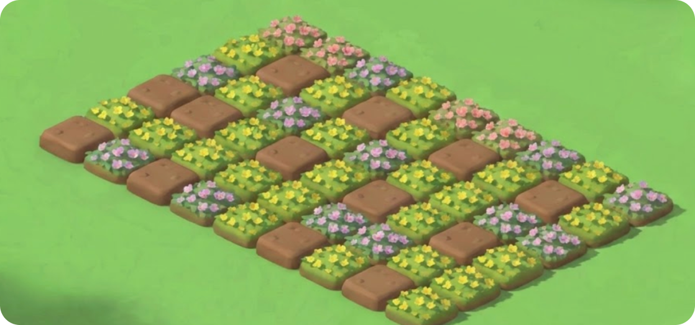

# 🌻 花园自动种花功能 - 功能说明

## 📋 功能概述

本次更新实现了**动态花园网格系统**，将原来的静态花园图片改为54个可独立控制的格子（6行×9列），实现了购买花朵后自动按顺序种植的功能。

---

## 🎯 实现的功能

### 1. **动态花园网格**
- ✅ 6行 × 9列 = 54个可种植格子
- ✅ 每个格子可以单独显示不同的花朵
- ✅ 按照**从左到右、从上到下**的顺序自动填充

### 2. **自动种植逻辑**
- ✅ 购买花朵后，系统自动找到第一个空格子
- ✅ 花朵以动画效果"生长"出来
- ✅ 实时更新已种植数量（例如：5/54 planted）

### 3. **视觉效果**
- ✅ **真实背景**：使用 `image(9).png` 等距插画作为花园底图
- ✅ **等距视角 (Isometric)**：网格通过 CSS3D 变换完美贴合斜向的土地
- ✅ **直立种植**：花朵自动进行反向变换，使其在斜面上保持竖直生长
- ✅ **无缝融合**：格子本身透明，花朵像是直接从插画里的泥土里长出来的

---

## 🔧 技术实现

### 修改的文件

#### 1. `index.html`
```html
<div class="garden-display">
    <!-- 底图 -->
    
    <!-- 覆盖在上面的3D网格 -->
    <div class="garden-grid" id="gardenGrid">...</div>
</div>
```

#### 2. `style.css`
**核心 3D 变换逻辑**：
```css
/* 让网格躺下，适配斜向视角 */
.garden-grid {
    transform: rotateX(60deg) rotateZ(-45deg);
    transform-style: preserve-3d;
}

/* 让花朵站立，抵消网格的变换 */
.plot-flower {
   transform: rotateZ(45deg) rotateX(-60deg) translateY(-50%);
}
```

#### 3. `script.js`
新增函数：
- `initializeGardenGrid()` - 初始化54个格子
- `updateGardenUI(gardenData)` - 更新花园显示状态

---

## 📐 格子排列顺序

```
格子ID：从0到53，按以下顺序排列：

行1:  0   1   2   3   4   5   6   7   8
行2:  9  10  11  12  13  14  15  16  17
行3: 18  19  20  21  22  23  24  25  26
行4: 27  28  29  30  31  32  33  34  35
行5: 36  37  38  39  40  41  42  43  44
行6: 45  46  47  48  49  50  51  52  53
```

**种植顺序**：0 → 1 → 2 → ... → 53（从左到右，从上到下）

---

## 🎮 游戏流程示例

### 场景：用户购买3朵花

1. **初始状态**：54个空格子（都是棕色泥土）
2. **购买第1朵玫瑰**：
   - 扣除5金币
   - 在格子0种植玫瑰
   - 显示 "1/54 planted"
3. **购买第2朵向日葵**：
   - 扣除5金币
   - 在格子1种植向日葵
   - 显示 "2/54 planted"
4. **购买第3朵郁金香**：
   - 扣除5金币
   - 在格子2种植郁金香
   - 显示 "3/54 planted"

**结果**：花园第一行的前三个格子依次显示玫瑰、向日葵、郁金香

---

## 🎨 视觉效果说明

### 格子颜色
- **空格子**：棕色渐变 `#8D6E63 → #A1887F`
- **已种植**：绿色渐变 `#689F38 → #8BC34A`

### 花朵动画
```css
/* 生长动画：0.6秒 */
0%   - 缩放0%，旋转-180°，透明
60%  - 缩放120%，旋转15°
100% - 缩放100%，旋转0°，完全显示
```

---

## 🔄 数据同步

### Firestore 数据结构
```javascript
{
  garden: {
    plots: {
      maxPlots: 54,
      occupiedPlots: 3,  // 已种植数量
      grid: [
        {
          id: 0,
          flower: 'rose',
          flowerName: '玫瑰花苞',
          flowerImage: 'image/image (4).png',
          plantedAt: '2026-01-28T10:00:00Z',
          plantedBy: 'user2'
        },
        {
          id: 1,
          flower: 'sunflower',
          flowerName: '向日葵',
          flowerImage: 'image/image (5).png',
          plantedAt: '2026-01-28T10:05:00Z',
          plantedBy: 'user1'
        },
        // ... 更多格子
      ]
    }
  }
}
```

---

## 📱 响应式设计

- ✅ **移动端优化**：格子自适应屏幕宽度
- ✅ **触摸友好**：格子大小适合点击/触摸
- ✅ **性能优化**：使用 `lazy loading` 加载花朵图片

---

## 🐞 调试工具

### 显示格子序号（可选）
在 `script.js` 中取消注释以下代码：
```javascript
// const numberSpan = document.createElement('span');
// numberSpan.className = 'plot-number';
// numberSpan.textContent = plotIndex;
// plotDiv.appendChild(numberSpan);
```

### 浏览器控制台调试
```javascript
// 查看游戏状态
window.gameDebug.getState();

// 手动购买花朵
window.gameDebug.buyFlower('rose');

// 重新加载数据
window.gameDebug.reload();
```

---

## ✨ 未来可扩展功能

1. **点击格子查看详情**
   - 显示花朵名称、种植时间、种植者

2. **花朵生长阶段**
   - 花苗 → 开花 → 盛开
   - 根据种植时间显示不同阶段

3. **主题花园**
   - 用户可选择不同花园背景
   - 春夏秋冬主题

4. **花朵收获**
   - 达到一定数量后可收获获得特殊奖励

---

## 🎉 总结

现在你的花园游戏拥有了：
- ✅ 54个独立可控的格子
- ✅ 自动按顺序种植花朵
- ✅ 精美的生长动画
- ✅ 实时数据同步
- ✅ 完整的游戏逻辑

**享受种花的乐趣吧！🌻🌷🌹🌺**

---

*最后更新：2026-01-28*  
*开发者：Antigravity AI*
